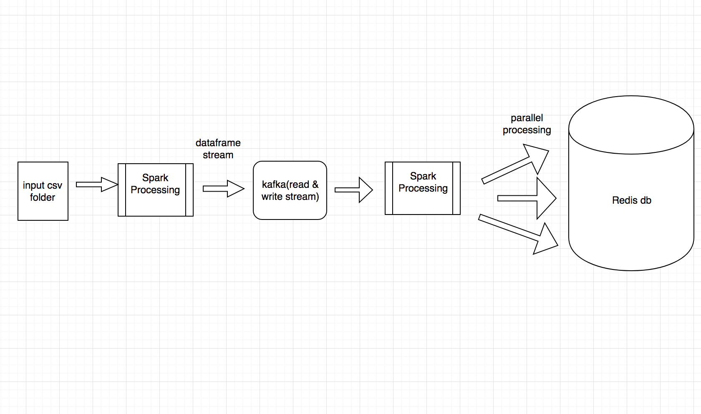

# redis-task
Architecture Design

The process is as follows

1. Get the input directory which contains csv files to be processed.

2. Spark process to get the dataframe and stream it to kafka
   Two things are involved:
   1. Select dataframe having dateAdded (format-> yyy-mm-dd)
   as key and columns(id, dateAdded, brand, colors) as value and 
   stream it to kafka in topic timestamp
   2. Select dataframe having dateAdded(as such) as key and columns
   (id,dateAdded, brand, colors) as value and stream it to kafka
   in topic colors

3. Kafka reads the stream and process it via spark to select
   key and value from dataframe.
   Every row is prcoessed and stored in Redis Db using the following
   logic.
   
   1.To get the recent item "event:Recent:" + dateAdded(yyy-mm-dd)
   key is used. This key will compare dateAdded(timestamp) with every
   input and store the recent value(id,brand,dateAdded,colors)
   
   2.To get the brands count "event:Brand:" + dateAdded(yyy-mm-dd) key is used.
   This key will have hash of brands and its count. Update the value whenever
   brand is seen for the given dateAdded. Api will fetch the above key for given date
   and sort the value in descending.
   
   3.To get top 10 colors "event:Color" + color key is used and zadd datastructure is used.
   zadd will have dateAdded(epoch) as score and hash of values of that
   record(id, dateAdded, colors, brand). While fetching via api zrevrangebyscore
   is used to get top 10. "event:Color" + color (key is formed by iterating over
   each colors of input record while reading from the stream produced by kafka).
   
   All the 3 processes are done after consumed by Kafka.
   
Apis are done using flask
1.getRecentItem 2. getBrandsCount 3.getRecentItemsbyColor three
are done. 